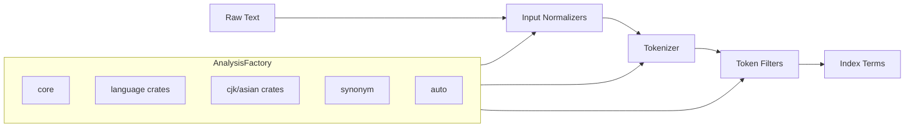
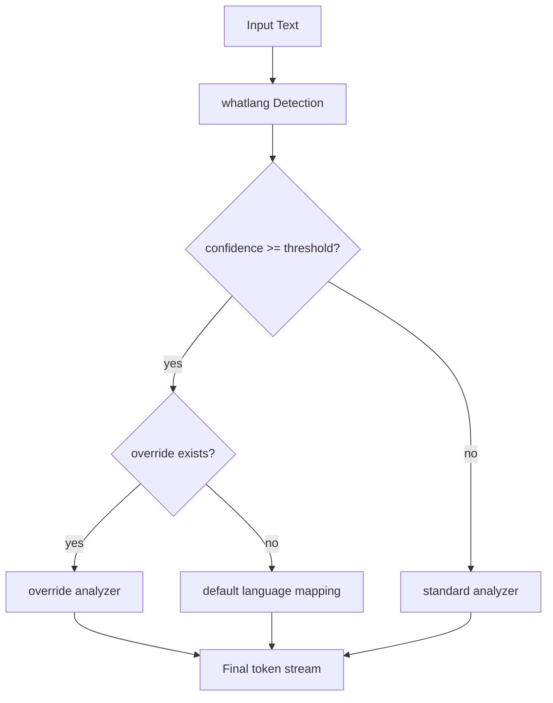
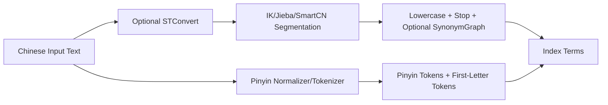

Search quality is decided before ranking even starts.

If your analysis layer is weak, every downstream component pays for it: matching, highlighting, aggregations, typo tolerance, and query understanding. That is why we invested heavily in Pizza Analysis and turned it into one of the strongest parts of the platform.

Today, Pizza Analysis is not a single tokenizer with a few stopwords. It is a multilingual analysis stack designed for real production workloads.

## What We Built

At a high level, Pizza Analysis provides:

- 39 analysis plugins
- 27 dedicated language plugin crates
- 70+ prebuilt analyzers
- 140+ token filters
- 27 tokenizers
- 13 input normalizers

And more importantly, it does this with a modular architecture teams can actually operate, test, and evolve.

## Explore on GitHub

- Analysis meta-crate (all plugins): [github.com/pizza-rs/analysis-all](https://github.com/pizza-rs/analysis-all)
- Auto language analyzer: [github.com/pizza-rs/analysis-auto](https://github.com/pizza-rs/analysis-auto)
- Synonym plugin (with hot-reload): [github.com/pizza-rs/analysis-synonym](https://github.com/pizza-rs/analysis-synonym)
- Core analysis primitives: [github.com/pizza-rs/analysis-core](https://github.com/pizza-rs/analysis-core)

## Why This Matters

Most modern datasets are multilingual, noisy, and domain-specific.

You are indexing a mix of:

- product catalogs with transliterated brand names
- support tickets in multiple languages
- documents with CJK scripts and Latin fragments in the same field
- short, ambiguous user queries
- entity aliases and phrase-level synonym variants

A generic analysis chain cannot handle this well. You need language-aware pipelines and a controlled way to compose them.

## The Architecture in Practice

Pizza Analysis follows a clear pipeline model:

1. Character/input normalization
2. Tokenization
3. Token filtering (lowercase, stopwords, stemming, synonym graph, etc.)
4. Analyzer composition for each language or use case

This sounds simple, but the impact is huge: deterministic behavior, easier debugging, and safer iteration.

### System Architecture Diagram



### Runtime Routing Diagram (Auto Analyzer)



## Technical Deep Dive

Pizza Analysis is deliberately split into dedicated crates so each language family can evolve independently without destabilizing the rest of the stack.

### Analyzer Composition Strategy

A typical high-quality analyzer chain is:

1. script-aware normalization
2. language-appropriate tokenization
3. stopword filtering
4. stem/lemmatize (when available)
5. optional synonym graph expansion

For example, Indic analyzers use `indic_normalization` as a shared base, then add language-specific normalization and stemming where available.

### CJK Strategy Selection

Instead of one CJK fallback for all scenarios, Pizza allows strategy by workload:

- `ik` for practical Chinese segmentation in many search workloads
- `jieba` for flexible Chinese segmentation behavior
- `smartcn` for dictionary/statistical segmentation style
- `kuromoji` for Japanese morphology-aware tokenization
- `nori` for Korean morphology-aware tokenization

This is essential for balancing recall vs precision depending on corpus shape and query length distribution.

## Code Examples (Real Usage)

### 1. Register a full multilingual stack

```rust
use pizza_engine::analysis::AnalysisFactory;

let mut factory = AnalysisFactory::new();

// Register everything (core + language plugins + auto)
pizza_analysis_all::register_all(&mut factory);

// Pick analyzers by name
let english = factory.get_analyzer("english").unwrap();
let japanese = factory.get_analyzer("kuromoji").unwrap();
let auto = factory.get_analyzer("auto").unwrap();
```

### 2. Use the auto analyzer with confidence and overrides

```rust
use pizza_analysis_auto::AutoTokenizer;

let mut auto_tokenizer = AutoTokenizer::new(analyzers, fallback);

// Default is 0.3; make it stricter for production traffic
auto_tokenizer.set_confidence_threshold(0.5);

// Route Chinese detection to jieba instead of default ik
auto_tokenizer.set_override("cmn", "jieba");

// Route Japanese detection to cjk bigram for a specific use case
auto_tokenizer.set_override("jpn", "cjk");
```

### 3. Hot-reload synonyms without restart

```rust
use pizza_analysis_synonym::{SynonymFilter, SynonymParser};

let filter = SynonymFilter::empty();
let handle = filter.reload_handle();

// Initial load
let map_v1 = SynonymParser::new().parse("tv, television\nny => new york");
handle.reload(map_v1);

// Later: update from config/file watcher endpoint
let map_v2 = SynonymParser::new().parse("tv, television, smart tv\nny => new york city");
handle.reload(map_v2);
```

This is exactly the kind of runtime workflow relevance teams need when tuning live systems.

## Deep Language Coverage

We support broad language coverage across dedicated analyzers and specialized segmentation engines.

### Dedicated per-language analyzers

Pizza ships dedicated analyzers for major language families, including:

- English, French, German, Spanish, Italian, Portuguese, Dutch
- Russian, Greek, Norwegian, Swedish, Finnish, Hungarian, Turkish
- Arabic, Persian, Hindi, Bengali, Indonesian, Brazilian Portuguese
- Vietnamese, Thai
- Tamil, Telugu, Kannada, Malayalam

These analyzers are not cosmetic wrappers. They encode language-specific normalization, stopword strategy, and stemming behavior where available.

Representative language crates:

- Vietnamese: [github.com/pizza-rs/analysis-vietnamese](https://github.com/pizza-rs/analysis-vietnamese)
- Thai: [github.com/pizza-rs/analysis-thai](https://github.com/pizza-rs/analysis-thai)
- Tamil: [github.com/pizza-rs/analysis-tamil](https://github.com/pizza-rs/analysis-tamil)
- Telugu: [github.com/pizza-rs/analysis-telugu](https://github.com/pizza-rs/analysis-telugu)
- Kannada: [github.com/pizza-rs/analysis-kannada](https://github.com/pizza-rs/analysis-kannada)
- Malayalam: [github.com/pizza-rs/analysis-malayalam](https://github.com/pizza-rs/analysis-malayalam)

### CJK and script-specific specialization

For East Asian text, quality depends on segmentation strategy. Pizza includes dedicated analyzers/tokenizers for:

- IK for Chinese segmentation
- Jieba for Chinese segmentation
- SmartCN for Chinese segmentation
- Kuromoji for Japanese morphological analysis
- Nori for Korean morphological analysis
- CJK bigram pipeline for fallback and mixed-script scenarios

This gives teams practical control instead of forcing one segmentation approach across all workloads.

Related CJK repos:

- IK: [github.com/pizza-rs/analysis-ik](https://github.com/pizza-rs/analysis-ik)
- Jieba: [github.com/pizza-rs/analysis-jieba](https://github.com/pizza-rs/analysis-jieba)
- SmartCN: [github.com/pizza-rs/analysis-smartcn](https://github.com/pizza-rs/analysis-smartcn)
- Kuromoji: [github.com/pizza-rs/analysis-kuromoji](https://github.com/pizza-rs/analysis-kuromoji)
- Nori: [github.com/pizza-rs/analysis-nori](https://github.com/pizza-rs/analysis-nori)

### IK Performance Optimization (Technical Notes)

IK is one of the most performance-sensitive analyzers in real deployments because Chinese segmentation is often on hot query/index paths.

Our optimization focus for IK workloads is:

- dictionary traversal efficiency (reduce repeated branch work)
- token emission discipline (avoid unnecessary intermediate allocations)
- short-circuit logic for non-productive branches
- analyzer-chain ordering to minimize downstream filter cost

Practical tuning pattern:

1. profile segmentation hotspots on real corpus distributions
2. benchmark IK smart vs max-word by workload (index-time vs query-time)
3. measure token count inflation and its impact on posting-list fanout
4. tune analyzer chain to keep useful recall while controlling term explosion

Dedicated repo:

- IK plugin: [github.com/pizza-rs/analysis-ik](https://github.com/pizza-rs/analysis-ik)

### Pinyin in Production Pipelines

Pinyin support is critical for Chinese name/entity retrieval and cross-input-method matching.

Typical usage patterns:

- Chinese characters -> full pinyin tokens for tolerant lookup
- first-letter pinyin for shorthand query behavior
- dual-field indexing (original Han + pinyin-normalized field)

Pinyin + ST conversion are usually combined in multilingual Chinese deployments.

Dedicated repos:

- Pinyin plugin: [github.com/pizza-rs/analysis-pinyin](https://github.com/pizza-rs/analysis-pinyin)
- Simplified/Traditional conversion: [github.com/pizza-rs/analysis-stconvert](https://github.com/pizza-rs/analysis-stconvert)

### CJK Execution Flow (IK + Pinyin + STConvert)



This dual-lane design is commonly used to preserve Han-character precision while adding pinyin recall paths for transliterated user input.

## Dedicated Repository Matrix

| Area | Repo |
|:-----|:-----|
| Meta integration | [github.com/pizza-rs/analysis-all](https://github.com/pizza-rs/analysis-all) |
| Core analysis primitives | [github.com/pizza-rs/analysis-core](https://github.com/pizza-rs/analysis-core) |
| Auto language routing | [github.com/pizza-rs/analysis-auto](https://github.com/pizza-rs/analysis-auto) |
| Synonym + graph + hot-reload | [github.com/pizza-rs/analysis-synonym](https://github.com/pizza-rs/analysis-synonym) |
| Chinese IK | [github.com/pizza-rs/analysis-ik](https://github.com/pizza-rs/analysis-ik) |
| Chinese Jieba | [github.com/pizza-rs/analysis-jieba](https://github.com/pizza-rs/analysis-jieba) |
| Chinese SmartCN | [github.com/pizza-rs/analysis-smartcn](https://github.com/pizza-rs/analysis-smartcn) |
| Japanese Kuromoji | [github.com/pizza-rs/analysis-kuromoji](https://github.com/pizza-rs/analysis-kuromoji) |
| Korean Nori | [github.com/pizza-rs/analysis-nori](https://github.com/pizza-rs/analysis-nori) |
| Chinese Pinyin | [github.com/pizza-rs/analysis-pinyin](https://github.com/pizza-rs/analysis-pinyin) |
| Simplified/Traditional conversion | [github.com/pizza-rs/analysis-stconvert](https://github.com/pizza-rs/analysis-stconvert) |
| Vietnamese | [github.com/pizza-rs/analysis-vietnamese](https://github.com/pizza-rs/analysis-vietnamese) |
| Thai | [github.com/pizza-rs/analysis-thai](https://github.com/pizza-rs/analysis-thai) |
| Tamil | [github.com/pizza-rs/analysis-tamil](https://github.com/pizza-rs/analysis-tamil) |
| Telugu | [github.com/pizza-rs/analysis-telugu](https://github.com/pizza-rs/analysis-telugu) |
| Kannada | [github.com/pizza-rs/analysis-kannada](https://github.com/pizza-rs/analysis-kannada) |
| Malayalam | [github.com/pizza-rs/analysis-malayalam](https://github.com/pizza-rs/analysis-malayalam) |

## Support Matrix

The table below summarizes what is available today in Pizza Analysis.

| Capability | Coverage | Notes |
|:-----------|:---------|:------|
| Plugin ecosystem | 39 plugins | Modular crates, feature-gated composition |
| Dedicated language crates | 27 | Per-language normalization/stopword/stemming pipelines |
| Prebuilt analyzers | 70+ | Ready-to-use analyzers for indexing/querying |
| Token filters | 140+ | Includes stemming, graph synonyms, script normalization |
| Tokenizers | 27 | Standard + specialized CJK/Asian tokenizers |
| Input normalizers | 13 | Character-level normalization stage |
| Auto language routing | Yes | whatlang-based detection + threshold + per-language overrides |
| Synonym hot-reload | Yes | Runtime map replacement without restart |
| CJK specialization | IK, Jieba, SmartCN, Kuromoji, Nori, CJK | Multiple segmentation strategies by workload |
| Indic dedicated analyzers | Tamil, Telugu, Kannada, Malayalam, Hindi, Bengali | Includes script-specific normalization and stemming where available |
| Southeast Asian analyzers | Vietnamese, Thai, Indonesian | Includes dedicated Vietnamese and Thai pipelines |
| no_std compatibility | Yes | Designed for embedded/low-footprint deployments |

## Auto Language Detection That Actually Helps

The auto analyzer routes input to the best analyzer at runtime.

It supports:

- confidence threshold control
- override by detected language code
- dedicated mapping for CJK analyzers
- dedicated mappings for newly added Indic analyzers

This is critical when language is unknown or mixed at ingestion time. Instead of forcing index-level segmentation decisions too early, teams can adapt per field, per document, and even per use case.

## Production-Grade Synonyms with Hot Reload

Synonyms are where relevance engineering often becomes operationally painful. We focused on making this production-friendly.

Pizza supports:

- synonym and synonym_graph filters
- single-word and multi-word mappings
- expand and contract modes
- dynamic hot reload

Recent improvements enable lock-safe map swapping so synonym updates can be applied without disruptive restarts.

## Why Pizza Analysis Is Different

The key difference is not one single feature. It is the combination:

- strong language coverage
- composable architecture
- specialized analyzers for hard scripts
- operational features for continuous relevance tuning
- modular packaging via plugin crates

This lets product and search teams ship relevance improvements continuously rather than in risky quarterly batches.

## Real Workload Scenarios

### Global ecommerce

- multilingual titles and attributes
- variant brand spellings and aliases
- language-dependent stemming and stopwords

Result: better recall without sacrificing precision.

### Support and knowledge search

- mixed-language tickets and comments
- phrase-level synonym handling
- robust normalization for messy text

Result: better answer findability and lower query friction.

### Mixed-script content platforms

- CJK text mixed with Latin and numeric symbols
- language unknown at write time
- high volume of user-generated text

Result: more stable relevance across regional traffic patterns.

## The Engineering Principle Behind It

We treat analysis as first-class infrastructure, not preprocessing glue.

That means:

- explicit analyzer definitions
- clear registration and composition
- testable behavior at each stage
- safe runtime updates for relevance assets like synonyms

When this layer is solid, every ranking and retrieval improvement lands on stronger ground.


## Closing

Search quality starts with language understanding. Pizza Analysis gives us a powerful, modular, and operationally practical foundation for that work.

If your workload is multilingual, noisy, and constantly evolving, this is exactly the layer that determines whether search feels average or exceptional.

Pizza Analysis is how we make it exceptional.

Pizza is being open-sourced now. Keep an eye on us and follow along.
